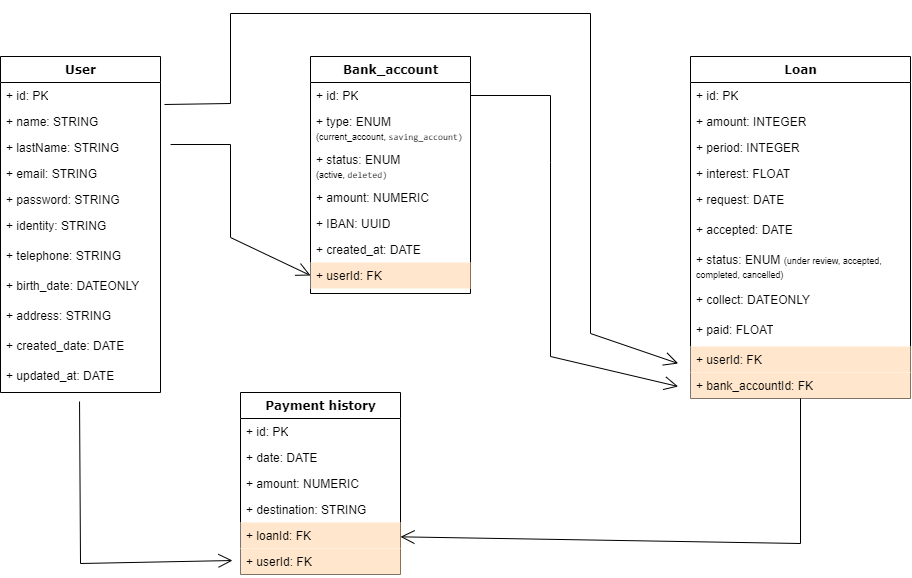

# Prueba Backend

Esta es una API donde puedes ingresar a la informacion, solamente luego de loguearte.
Esta API contiene informacion y la estructura de un sistema bancario.

## Estructura de base de datos

La base de datos cuenta con tablas de usuarios, cuentas bancarias, prestamos e historial de pago.
Todas las tablas cuentas con un id que es la primary key (PK) o llave primaria.

### Usuario

Esta tabla cuenta con datos personales como nombre, apellido, DNI, domicilio, fecha de nacimiento, email y telefono.
Tanto el DNI como el email deben ser datos unicos, es decir que no van a existir dos usuarios con el mismo DNI o email.
Ademas cuenta con una fecha de creado del usuario y fecha de actualizado.
En cuanto a las relaciones, el usuario va a presentar una relacion de uno a muchos con las siguientes tablas:
- Cuentas bancarias: ya que un usuario puede tener muchas cuentas bancarias pero una cuenta bancaria va a pertenecer a un usuario.
- Prestamos: ya que un usuario puede tener muchos prestamos pero un prestamo va a corresponder a un usuario.
- Historial de pagos: ya que un usuario puede realizar varios pagos, pero un pago va a ser realizado por un usuario.

### Cuenta bancaria

Esta tabla cuenta con:
- tipo de cuenta (la cual solo da la opcion de cuenta corriente o caja de ahorros), 
- un monto (que es la cantidad de dinero que dispone esa cuenta, representada en numeros con 2 decimales), 
- IBAN (que es una clave unica que identifica al banco y a la cuenta, que en esta base de datos va a ser un numero autoincremental pero deberia ser un IBAN valido para el pais)
- estado (la cual puede ser active o deleted, lo cual se va a utilizar para el borrado logico en caso que se quiera eliminar una cuenta bancaria)
- fecha de creada.
- foreign key (FK) correspondiente al id del usuario a la cual va a estar relacionada esa cuenta.
En cuanto a las relaciones, la cuenta bancaria va a presentar una relacion de uno a muchos con las siguientes tablas:
- Prestamos: ya que una cuenta puede recibir muchos prestamos pero un prestamo va a transferirse a una sola cuenta.
- Historial de pagos: ya que una cuenta puede recibir varios pagos, pero un pago va a transferirse a una sola cuenta.

### Prestamo

Esta tabla cuenta con:
- el monto del prestamo (que es un numero entero que declarara el administrador), 
- periodo (que es un numero entero que corresponde a la cantidad de meses en los cuales se va a pagar ese prestamo), 
- interest (que es un numero que acepta hasta 2 decimales y corresponde a la tasa de interes representada en porcentaje que se va a agregar al monto. Ej: si se quiere agregar una tasa de interes del 12.5%, se debe completar con el numero 12.5),
- solicitud (request) y aceptada (acepted) que van a ser fechas. La solicitud corresponde al momento en que el usuario solicita el prestamo, y aceptada corresponde al momento en que el administrador acepta ese prestamo,
- collect que es un array de fechas son en las que debe pagar cada cuota el usuario,
- FK correspondiente al id del usuario que solicita el prestamo,
- FK correspondiente al id de la cuenta a la que se va a transferir el prestamo.

### Historial de pago

Esta tabla cuenta con:
- fecha del pago,
- monto representado en un numero con 2 decimales
- destinatario que es el IBAN de la cuenta a la que se efectua el pago (en caso de realizarlo a una cuenta)
- FK correspondiente al id del prestamo en caso que el pago sea por una cuota del prestamo
- FK correspondiente al id del usuario que realiza el pago.

Aqui se puede ver el diagrama de la base de datos

## Rutas

A continuacion se detallaran las diferentes rutas.

### Autenticacion

Registro: se manda un POST a la ruta /auth/register, donde se crea el registro de un usuario, recibiendo por body name, last_name, email, password, identity (DNI/NIE), telephone, birth_date y address. Se hashea la contraseña y se almacena en la base de datos. Devuelve el user con todos los datos personales, excepto la contraseña.
Login: se manda por POST a la ruta /auth/login, donde se recibe por body el email y la contraseña y se los compara con los de la base de datos, si hay coincidencias, se genera un token, el cual se devuelve y es el que va a ser requerido en cada solicitud a la API.
El token expira a los 30 minutos y contiene el id del usuario

### Usuarios

Obtener datos del usuario: para esto se manda un GET a la ruta /user/getUser, donde se manda el id del usuario por el token y se obtienen los datos en la base de datos.
Modificar el usuario: para esto se manda un POST a la ruta /user/update, se pasan por body los datos a modificar y el id del usuario por el token. Solo permite modificar la direccion y el numero de telefono.

### Cuentas bancarias

Obtener datos de todas las cuentas bancarias asociadas a un usuario: para esto se manda un GET a la ruta /account/getAccounts/:id, donde se pasa el id del usuario por params.
Crear una cuenta bancaria: se manda un POST a la ruta /account/create, pasando por body el tipo de cuenta que puede ser current_account o saving_account y el id del usuario. El resto de valores como el IBAN y el monto se agregan por default
Eliminar una cuenta: se manda un DELETE a la ruta /account/delete/:accountId pasando por params el id de la cuenta que se quiere eliminar. Se realiza el borrado logico, lo cual evita que el usuario pueda volver a acceder a la cuenta pero la misma queda almacenada en la base de datos, modificando su estado de 'active' a 'deleted'.

### Prestamo

Solicitar un prestamo: se manda un POST a la ruta /loan/request y se envia por body el monto, periodo, tasa de interes, id del usuario y el id de la cuenta bancaria a la que se va a depositar ese dinero. Devuelve el prestamo, en estado 'under review', por lo que el administrador debe aceptar el prestamo para que se efectivice.

Cancerlar un prestamo: se manda un PUT a la ruta /loan/cancel/:loanId y se envia por params el id del prestamo que se desea cancelar. Si el estado del prestamo es 'under review', el prestamo se puede cancelar, cambiando el estado a 'canceled'. En cambio, si el estado ya dejo de ser 'under review', el prestamo no puede cancelarse ya que fue depositado el dinero en la cuenta del usuario.

Aceptar un prestamo: se manda un PUT a la ruta /loan/accept/:loanId y se efectiviza el prestamo por lo que el estado del prestamo pasa a 'accepted', se acredita el dinero en la cuenta del usuario y se determina la fecha de comienzo del pago del prestamo (1 mes posterior a la acreditacion del mismo).
Para que esta ruta sea viable, debe haber una propiedad del usuario que determine que es administrador para poder acceder a esta ruta, evitandola en cualquier otro usuario.
No hice esto por falta de tiempo.

### Historial de pago

Solicitar el historial de pago: se manda un GET a la ruta /payment/get_payments/:userId, donde se envia por params el id del usuario, devolviendo todos los pagos asociados a ese usuario.